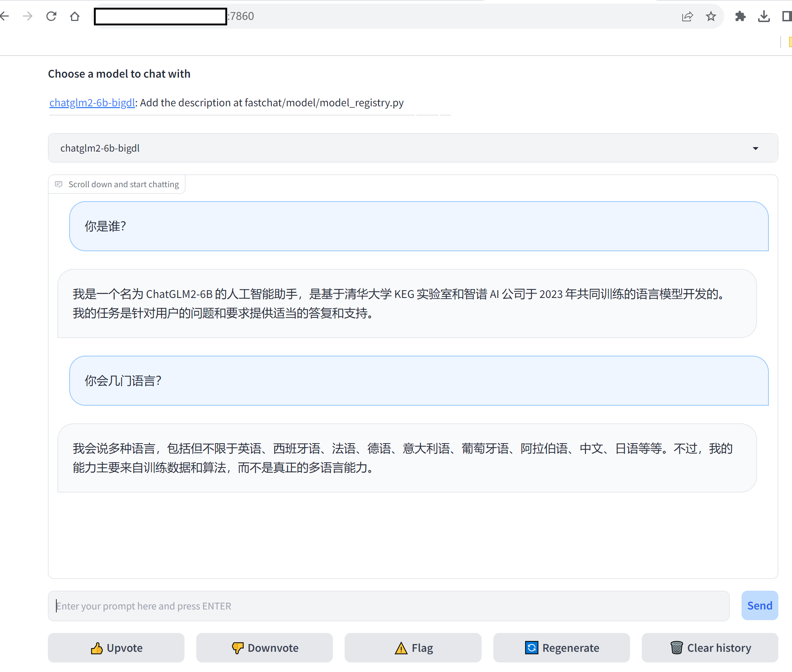

# LLM inference in TEE

LLM ( Large Language Model) inference in TEE can protect the model, input prompt or output. The key challenges are:

1. the performance of LLM inference in TEE (CPU)
2. can LLM inference run in TEE?

With the significant LLM inference speed-up brought by [BigDL-LLM](https://github.com/intel-analytics/BigDL/tree/main/python/llm), and the Occlum LibOS, now high-performance and efficient LLM inference in TEE could be realized.

A chatglm2 6B model inference demo by Occlum and BigDL-LLM in TEE is introduced below.

## Start the Occlum development container
```bash
docker run --rm -it --network host \
    --device /dev/sgx_enclave --device /dev/sgx_provision \
    occlum/occlum:latest-ubuntu20.04 bash
```

## Download the model

First of all, download the [THUDM/chatglm2-6b](https://huggingface.co/THUDM/chatglm2-6b). Put it in the directory such as **/work/models**.

## Install required python packages

Just run the script [install_python_with_conda.sh](./install_python_with_conda.sh).
It creates a conda python 3.9 env and install **bigdl-llm[all]**.

## Build Occlum instance

Besides the python packages, the demo also requires demo code and model to be existed in Occlum instance. 

The demo code below are copied from BigDL-LLM [chatglm2](https://github.com/intel-analytics/BigDL/tree/main/python/llm/example/CPU/HF-Transformers-AutoModels/Model/chatglm2).
```
./chatglm2/generate.py
./chatglm2/streamchat.py
```

To simply the Occlum instance creation, a hostfs mount is used to mount previous downloaded chatglm2-6B model to Occlum. Just run the script [build_occlum_instance.sh](./build_occlum_instance.sh) to create the Occlum instance.

* Note, this demo has model protection in use (TEE memory) but no protection on model in storage. To add protection on model in storage, some more operation such as model encryption and decryption may need imported.

## Run the demo

### Example 1, Predict Tokens using `generate()` API

```bash
cd occlum_instance
HF_DATASETS_CACHE=/root/cache \
    occlum run /bin/python3 /chatglm2/generate.py \
    --repo-id-or-model-path /models/chatglm2-6b
```

### Example2, Stream Chat using `stream_chat()` API

```bash
cd occlum_instance
HF_DATASETS_CACHE=/root/cache \
    occlum run /bin/python3 /chatglm2/streamchat.py \
    --repo-id-or-model-path /models/chatglm2-6b
```

For both examples, more arguments info could refer to BigDL-LLM [chatglm2](https://github.com/intel-analytics/BigDL/tree/main/python/llm/example/CPU/HF-Transformers-AutoModels/Model/chatglm2).

## LLM Inference Benchmark

Based on the [benchmark](https://github.com/intel-analytics/BigDL/tree/main/python/llm/dev/benchmark) demo from BigDL, a simple [benchmark](./benchmarks/) is provided to measure the performance of LLM inference both in host and in TEE.

Output will be like:
```
=========First token cost xx.xxxxs=========
=========Last token cost average xx.xxxxs (xx tokens in all)=========
```

The following **model_path** could be the path of chatglm2-6b or Qwen-7B-Chat.
**OMP_NUM_THREADS** is used to set the number of threads for OpenMP.

### Benchmark in Host
```bash
OMP_NUM_THREADS=16 ./python-occlum/bin/python \
    ./benchmarks/bench.py  --repo-id-or-model-path <model_path>
```

### Benchmark in TEE
```bash
cd occlum_instance
OMP_NUM_THREADS=16 occlum run /bin/python3 \
    /benchmarks/bench.py --repo-id-or-model-path <model_path>
```

By our benchmark result in Intel Ice Lake server, LLM inference performance within a TEE is approximately 30% less compared to on a host environment.

## Do inference with webui

[FastChat](https://github.com/lm-sys/FastChat#serving-with-web-gui) is an open platform for training, serving, and evaluating large language model based chatbots. 

BigDL-LLM also support FastChat with using BigDL-LLM as a serving backend in the deployment. Details please refer to [BigDL-LLM serving](https://github.com/intel-analytics/BigDL/tree/main/python/llm/src/bigdl/llm/serving).

For this demo, below commands show how to run an inference service in Occlum with webui interface.

In order to load models using BigDL-LLM, the model name should include "bigdl". For example, model **vicuna-7b** should be renamed to **bigdl-7b**. A special case is **ChatGLM** models. For these models, you do not need to do any changes after downloading the model and the BigDL-LLM backend will be used automatically. Details please refer to [Models](https://github.com/intel-analytics/BigDL/tree/main/python/llm/src/bigdl/llm/serving#models).

### Serving with WebGUI

To serve using the Web UI, you need three main components: web servers that interface with users, model workers that host one or more models, and a controller to coordinate the web server and model workers.

#### Launch the Controller in non-TEE env
```bash
./python-occlum/bin/python -m fastchat.serve.controller --host 0.0.0.0
```

This controller manages the distributed workers.

#### Launch the model worker(s) in Occlum
```bash
cd occlum_instance
occlum start
HF_DATASETS_CACHE=/root/cache  occlum exec /bin/python3 -m ipex_llm.serving.fastchat.model_worker --model-path /models/chatglm2-6b --device cpu --host 0.0.0.0
```
Wait until the process finishes loading the model and you see "Uvicorn running on ...". The model worker will register itself to the controller.

#### Launch the Gradio web server in Occlum

```bash
occlum exec /bin/python3 -m fastchat.serve.gradio_web_server --host 0.0.0.0
```

This is the user interface that users will interact with.

By following these steps, you will be able to serve your models using the web UI with `BigDL-LLM` as the backend. You can open your browser and chat with a model now.


