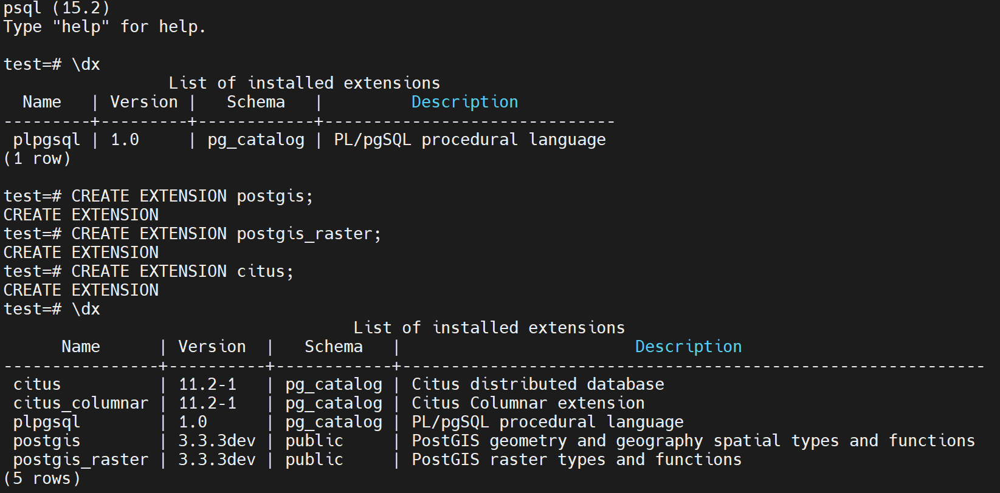

# Run PostgreSQL on Occlum

[`PostgreSQL`](https://www.postgresql.org/) is a powerful, open source object-relational database system that uses and extends the SQL language combined with many features that safely store and scale the most complicated data workloads.

Besides, PostgreSQL has powerful add-ons such as the popular [`PostGIS`](https://postgis.net/) geospatial database extender and [`Citus`](https://www.citusdata.com/) for distributed tables.

This demo demonstrates how to run a Postgres server in Occlum with extension PostGIS and Citus installed.

## Build Requirements

Assumping users do all the build on Occlum Ubuntu 20.04 based development docker image, such as "occlum/occlum:0.29.4-ubuntu20.04".

```
apt update
apt install -y flex libgeos-dev libgdal-dev liblz4-dev
```

## PostgreSQL modifications for Occlum

To support PostgreSQL running successfully in Occlum, some minor changes are required.

### Use vfork for starting subprocesses

PostgreSQL starts subprocesses by fork in default. But Occlum doesn't support **fork** method by design. To make PG runs in Occlum, macro **EXEC_BACKEND** needs to be defined and replace `fork+exec` by `vfork`.

### Do not check root

PostgreSQL forbids root user to run in default. But in Occlum LibOS, there is only root user.

### Undefine some macros to fit for Occlum

Occlum doesn't implement all syscalls. So some syscalls could be replaced/ignored by undefining some macros in `pg_config_manual.h`.

All above changes could be found on the [patch](./0001-Make-pg15-running-on-Occlum.patch).


## Build and install

Just run the script [`build_pg.sh`](./build_pg.sh). If everything goes well, it builds and installs PostgreSQL 15.2, and extensions PostGIS, Citus in the host `/usr/local/pgsql`.
```
./build_pg.sh
```

## Initialize the Data Base

Users can do the database initialization in host side before Occlum build.
```
/usr/local/pgsql/bin/initdb -D /usr/local/pgsql/data
```

## Build the Occlum Instance

Just run the script [`build_occlum_instance.sh`](./build_occlum_instance.sh).

Please note, two PG configuration files are provided as example, [`postgresql.conf`](./postgresql.conf) and [`pg_hba.conf`](./pg_hba.conf). Users can do customization themselves. Just remember re-run the `build_occlum_instance.sh` after the customization.

## Start the PG Server

Now users can start running the PG server in Occlum.
```
cd occlum_instance
occlum start
occlum exec /usr/local/pgsql/bin/pg_ctl -D /usr/local/pgsql/data -l /host/logfile start
```

It starts the PG server, and maps the PG log to host side. Users can find the logfile in the `occlum_instance` directory.

Then, users can create a `test` DB for following tests by using PG binaries installed in the host per `localhost`.
```
/usr/local/pgsql/bin/createdb test -h localhost
```

Now, users can do a simple benchmark.
```
/usr/local/pgsql/bin/pgbench -i -h localhost test
/usr/local/pgsql/bin/pgbench -h localhost -c 10 -t 1000 test
```

## Create PG Extensions

Also, users can access the PG server by psql shell like below.
```
/usr/local/pgsql/bin/psql test -h localhost
```

In our case, extensions PostGIS and Citus are already in the Occlum image file system, thus users can install these extensions.



After extensions installed, users can try spatial query or distributed scaling just as the general PG ways.