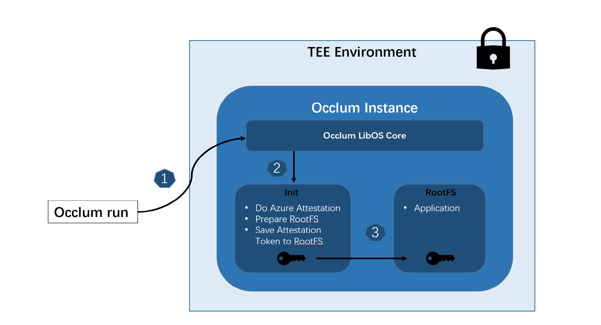

## Sample code for doing Microsoft Azure Attestation in Occlum init

This demo is programming in RUST, based on the Azure provided [`REST APIs`](https://docs.microsoft.com/en-us/rest/api/attestation/). It provides steps to do SGX quote generation and attestation in Occlum init process and save the attestation token to rootfs.



### Flow

1. **`Occlum run`** to start the Occlum instance.

2. For every Occlum instance, it starts `init` process first, then starts the real application in RootFS. The default [`init`](../../../tools/init/) process just run RootFS integrity check and then load the RootFS where the real application is located. For this demo, a modified [`init`](./init/) is used. Besides the general `init` operation, it does Azure Attestation and saves the token to `/root/token` in RootFS where the real application can access.

3. The real application starts with easy access to the Azure Attestation token. The application can set its own strategy for the token. In this demo, a simple `busybox` as real application is used to print the content of attestation token obtained in init process.

### Environments

There are three environments below which are provided to users to modify according to the actual scenarios.

* **MAA_PROVIDER_URL**
The MAA provider URL, this demo uses "https://shareduks.uks.attest.azure.net"
In default.

* **MAA_REPORT_DATA**
The report data (base64 encoded string) to be used for MAA quote generation.

* **MAA_TOKEN_PATH**
The MAA token and raw quote saved path in rootfs which is `/root` in default. Thus applications could find the attestation response token and raw quote (base64 encoded) in `/root/token` and `/root/quote_base64`.

Please refer to the [`scrit`](./build.sh) for how to modify the above environments.


* Build

1. Pull rust-sgx-sdk submodule which is the dependence of occlum dcap library.

```
# cd occlum
# git submodule update --init
```

2. Do the build with the [`scrit`](./build.sh).

```
# ./build.sh
```

* Run
```
# cd occlum_instance
# occlum run /bin/busybox cat /root/token
```

If successful, it prints the Azure attestation token.