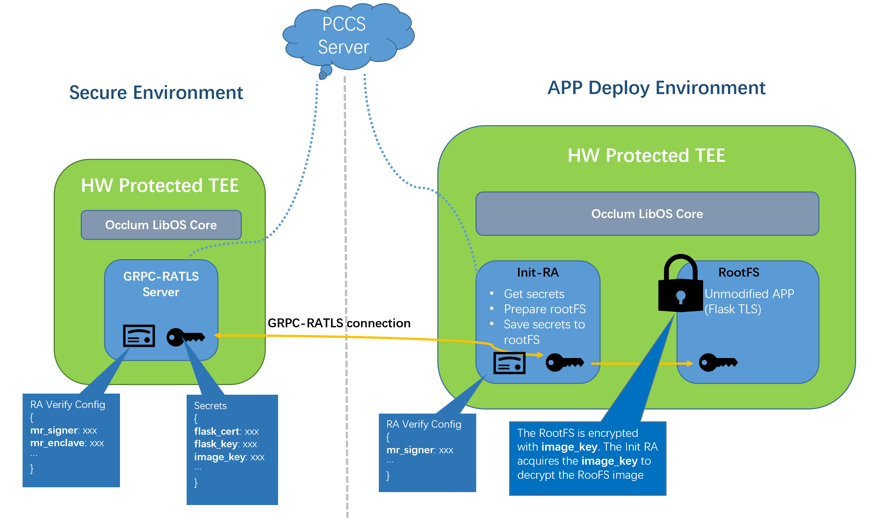

# Occlum RA Flow in a real demo

## Overview

Remote attestation is a key part in the confidential computing. Occlum provides a [`DCAP Library`](../../../tools/toolchains/dcap_lib/) to ease the RA application. A brief Occlum RA [`introduction`](../../../docs/remote_attestation.md) is a good entry point. But still, utilizing the RA in a real application is complicated for general developers.

Occlum provides a `Init RA` way to separate the RA operation and the actual application. With this way, the APP developers don't need know too much about the RA and the application doesn't need to be modified for RA.

This demo shows the `Init RA` way with a sample [`Flask TLS web application`](../../python/flask/), based on [`GRPC-RATLS`](../../../tools/toolchains/grpc_ratls) server/client implementation and a customized [`init`](../../../tools/init_grpc_ratls) for Occlum InitFS.

Note: users could choose different `init` by passing parameters on `occlum init` or `occlum new`. In this demo, **grpc-ratls** client is chosen.



The GRPC-RATLS server holds some sensitive data thus it is usually deployed on secure environment. The application consuming the sensitive data could be deployed on general environment, such as Cloud service vendor provided SGX instance. For this demo, all are running on one SGX machine.

## Flow

* Starts the GRPC-RATLS server. It holds `RA Verify Config` JSON and `Secrets` JSON files. The `RA Verify Config` JSON records which SGX quote part should be verified. The template is [`ra_config_template.json`](./ra_config_template.json), all supported `verify_xxx` are on in default.
```
{
    "verify_mr_enclave" : "on",
    "verify_mr_signer" : "on",
    "verify_isv_prod_id" : "on",
    "verify_isv_svn" : "on",
    "verify_config_svn" : "on",
    "verify_enclave_debuggable" : "on",
    "sgx_mrs": [
        {
            "mr_enclave" : "",
            "mr_signer" : "",
            "isv_prod_id" : 0,
            "isv_svn" : 0,
            "config_svn" : 0,
            "debuggable" : false
        }
    ],
    "other" : []
}
```
Users need decide which `verify_xxx` are taking effect.
1. if yes, fill in the measures data under `sgx_mrs`.
2. if no, set `verify_xxx` to `off`.

* **config_svn** is a 16 bits information brought by [`SGX KSS feature`](https://github.com/occlum/occlum/blob/master/docs/remote_attestation.md#sgx-kss-key-separation-and-sharing-feature-support), which provides a benefit that the enclave SGX quote (config_svn part) could be modified in running stage instead of signing stage.

Details could refer to the `build_server_instance` in script [`build_content.sh`](./build_content.sh).

The `RA Verify Config` JSON records the secrets. Each secret has a name and its base64 encoded string value, such as
```
{
    "flask_cert" : "dGVzdCBzYW1wbGUgY2VydGlmaWNhdGVzCg==",
    "flask_key" : "dGVzdCBzYW1wbGUga2V5Cg=="
    "image_key" : "YTUtNmQtN2YtY2YtYWUtOTMtZTItMWYtNWItOGEtODMtM2YtNzktNzgtMjktZmYK"
}
```

`flask_cert` and `flask_key` are generated by `openssl` by script `gen-cert.sh`. They are used for the Flask-TLS restful sever set-up.

`image_key` is used to encrypt the Occlum APP RootFS image which is `Flask-TLS` in this demo. It is generated by command `occlum gen-image-key image_key`. The image encryption could be done by `occlum build --image-key image-key`. With this encryption, anything saved in the RootFS has a good protection.

* Starts the Flask-TLS-Infer demo. For every Occlum built application, it starts `init` process first, then starts the real application in RootFS. The default [`init`](../../../tools/init/) process just run RootFS integrity check and then load the RootFS where the real application is located.

For this demo, a customized [`init`](../../../tools/init_grpc_ratls) is used. Besides the general `init` operation, it embeds the `GRPC-RATLS` client API `grpc_ratls_get_secret`, gets the secrets(base64 encoded) from the `GRPC-RATLS server`, does base64 decoding, acquires the real secrets. The `image_key` is used to decrypt the RootFS image. The other two are saved to RootFS. In this example, they are `/etc/flask.crt` and `/etc/flask.key`. Finally, when the Flask-TLS app is running, all secrets are securely obtained already in `init` thus the app runs successfully without RA involvement in this stage.

Also, to configure which KMS server (GRPC-RATLS server) is to be trusted, the default `init_ra_conf.json` needs modified accordingly. Details please refer to the function **update_client_init_ra_conf** in the script [build_content.sh](./build_content.sh).


## How-to build the demo

A valid PCCS service should be accessible in your environment. This demo is verified in Aliyun, thus `https://sgx-dcap-server.cn-shanghai.aliyuncs.com/sgx/certification/v3/` is used as the PCCS URL. For example, 

* Start the Occlum develop container
```
docker run --rm -it \
     --device /dev/sgx/enclave --device /dev/sgx/provision \
     occlum/occlum:latest-ubuntu20.04 bash
```

In the container, update the **pccs_url** in the file `/etc/sgx_default_qcnl.conf` with the valid address.

* Just run `build_content.sh` which builds everything.
Once successful, two Occlum instances are created.
```
occlum_client
occlum_server
```

## How-to run

* Starts the GRPC-RATLS server in background.
```
cd occlum_server
occlum run /bin/server localhost:50051 &
```

* Starts the Flask-TLS web portal in backgroud.
```
cd occlum_client
occlum run --config-svn 1234 /bin/rest_api.py &
```

Above two could be executed in one script [`run.sh`](./run.sh).

* Access the Flask-TLS web portal with valid certificate.
```
curl --cacert flask.crt -X PUT https://localhost:4996/customer/1 -d "data=Tom"
curl --cacert flask.crt -X PUT https://localhost:4996/customer/2 -d "data=Jerry"
curl --cacert flask.crt -X GET https://localhost:4996/customer/1
curl --cacert flask.crt -X GET https://localhost:4996/customer/2
```
