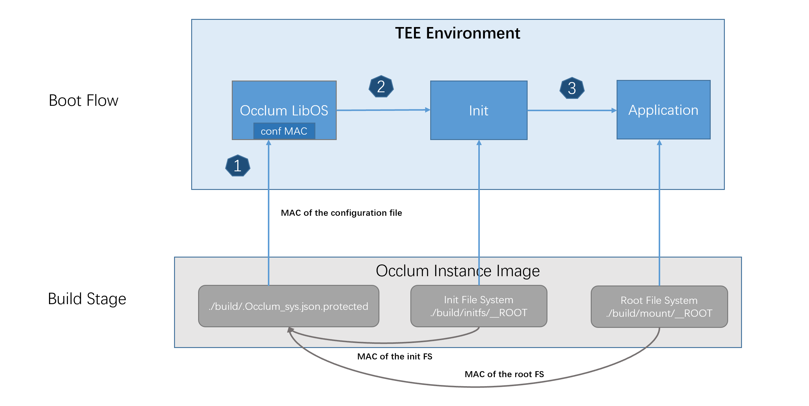

# Boot Flow Overview

Occlum has a unique **Occlum -> init ->application** boot flow, plus integrity check stage by stage. Below is the high-level overview.

## Measurements

There are total three MACs which are all generated in building stage and verified in boot flow.

* MAC of the init FS, it indicates the measurement of init file system which will be mounted in **init** stage.

* MAC of the root FS, it indicates the measurement of application file system which will be mounted in **application** stage.

* MAC of the configuration file. Both above MACs are filled into the configuration file. Thus the MAC of the configuration file reflects the differences of the two file systems to some extent.

## Boot flow

1. To user, the entry point is the command `occlum run`. The steps behind the command are PAL APIs `occlum_pal_init` and `occlum_pal_create_process`. It launches the Occlum LibOS kernel in the Enclave. The kernel then loads the configuration file `.Occlum_sys.json.protected`, doing integrity check with the MAC saved in the LibOS section **builtin_config** (marked as `conf_mac` in the picture). If pass, it uses the settings in the configuration file to do memory/process initialization. Then, it tries mount the init filesystem. It does integrity check again with init FS MAC in the `.Occlum_sys.json.protected`. If pass, the first user space process `init` got launched.

2. There is a default minimal `init` provided. In this `init`, it calls the Occlum added syscall `SYS_MOUNT_FS` to mount the application file system. The syscall implementation in the Occlum kernel does integrity check again with root FS MAC in the `.Occlum_sys.json.protected` to make sure expected application got launched.

3. At this stage, the real user application got launched.

Generally, all operation application required but not part of the application, such as remote attestation, could be put into **"init"**. This feature makes Occlum highly compatible to any remote attestation solution without involving application’s change.
