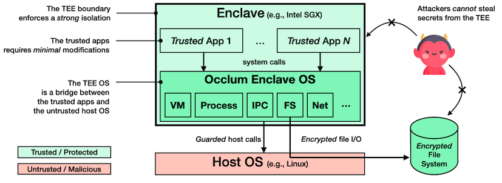

Welcome to Occlum's documentation!
===================================

**Occlum** is a memory-safe, multi-process library OS (LibOS) for Intel SGX.
As a LibOS, it enables legacy applications to run on SGX with little or even no modifications of source code, thus protecting the confidentiality and integrity of user workloads transparently.

.. note::

   This project is under active development.
   There is no guarantee that the content here are all up to date.

*****************
Table of Contents
*****************

.. toctree::
   :maxdepth: 2
   :caption: Introduction

   quickstart.md
   occlum_cmds.md
   occlum_configuration.md
   build_and_install.md
   install_occlum_packages.md
   binaries_compatibility.md
   how_to_debug.md

.. toctree::
   :maxdepth: 2
   :caption: Tutorials

   tutorials/gen_occlum_instance.md
   tutorials/distributed_pytorch.md
   tutorials/occlum_ppml.md

.. toctree::
   :maxdepth: 2
   :caption: Inside Occlum

   boot_flow.md
   filesystem/fs_overview.md
   filesystem/mount.md
   filesystem/encrypted_image.md
   remote_attestation.md

.. toctree::
   :maxdepth: 2
   :caption: Demos and Examples

   demos/demos.md
   tests/benchmark.md
   tests/tests.md

.. toctree::
   :maxdepth: 2
   :caption: Tools

   tools/toolchains.md
   tools/copy_bom.md

.. toctree::
   :maxdepth: 1
   :caption: Q&A

   qa.md