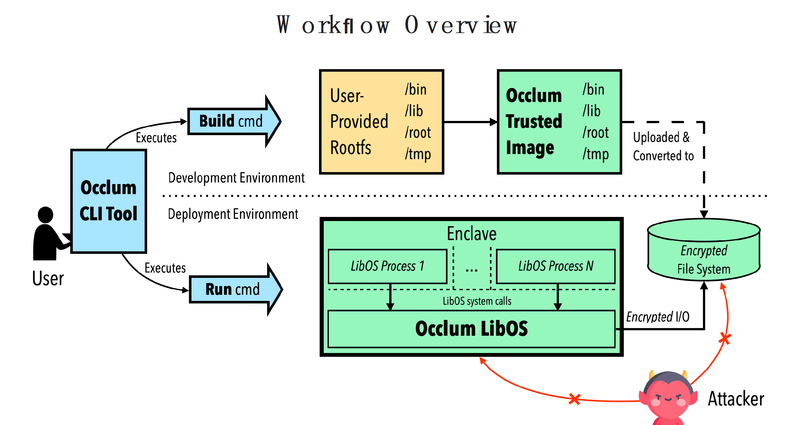

# User Commands

## Work Flow Overview



## General Commands

Occlum provides easy user commands as below.

```bash
occlum new <path>
```
Create a new directory at <path> and initialize as the Occlum instance.

```bash
occlum init
```
Initialize a directory as the Occlum instance.

```bash
occlum build [--sign-key <key_path>] [--sign-tool <tool_path>] [--image-key <key_path>] [-f/--force] [--enable-edmm <Y/N>]
```
Build and sign an Occlum SGX enclave (.so) and generate its associated secure FS image according to the user-provided image directory and Occlum.json config file.
The whole building process is incremental: the building artifacts are built only
when needed.
To force rebuilding all artifacts, give the [-f/--force] flag.

EDMM feature is not enabled by default. To enable it, set ENABLE_EDMM during the Occlum build phase as below:
```
ENABLE_EDMM=Y occlum build
```
Or
```
occlum build --enable-edmm Y
```
Details please refer to [doc](https://occlum.readthedocs.io/en/latest/edmm_config_guide.html).

```bash
occlum run <program_name> <program_args>
```
Run the user program inside an SGX enclave.

```bash
occlum package [<package_name>.tar.gz]
```
Generate a minimal, self-contained package (.tar.gz) for the Occlum instance.
The resulting package can then be copied to a deployment environment and unpacked
as a runnable Occlum instance.

All runtime dependencies required by the Occlum instance, except Intel SGX driver and Intel SGX PSW, are included in the package.

If package_name is not specified, the directory name of Occlum instance will be used.
In default only HW release mode package is supported. Debug or simulation mode package
could be supported by adding "--debug" flag.

```bash
occlum gdb <program_name> <program_args>
```
Debug the program running inside an SGX enclave with GDB.

```bash
occlum mount [--sign-key <key_path>] [--sign-tool <tool_path>] [--image-key <key_path>] <path>
```
Mount the secure FS image of the Occlum instance as a Linux FS at an existing <path>.
This makes it easy to access and manipulate Occlum's secure FS for debug purpose.

```bash
occlum gen-image-key <key_path>
```
Generate a file consists of a randomly generated 128-bit key for encryption of the FS image.

## Container-like Commands

Occlum has added several new experimental commands, which provide a more container-like experience to users, as shown below:

```bash
occlum start
```
Start an Occlum instance, completing all the initialization including LibOS boots, Init FS and application root FS mount. A background service is started to listen which application is going to be executed.

```bash
occlum exec [cmd1] [args1]
```
Actually start executing the application.

```bash
occlum exec [cmd2] [args2]
occlum exec [cmd3] [args3]
```
If there are more executable application binaries in the Occlum instance entrypoint, users could start executing them in parallel.

```bash
occlum stop
```
Stop the Occlum instance including the background listening service.
