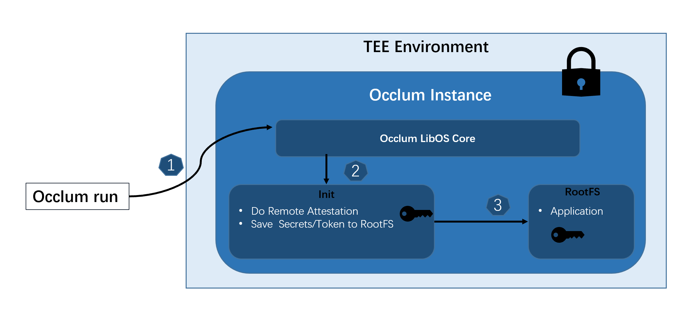

# Remote Attestation

Occlum provides wrapped library `libocclum_dcap` for `DCAP` remote attestion applications.
This Occlum DCAP library is prebuilt as part of the Occlum toolchains in the [Occlum Docker images](https://hub.docker.com/r/occlum/occlum).

The libraries are in the path `/opt/occlum/toolchains/dcap_lib`.
```
.
|-- glibc
|   |-- dcap_test
|   |-- libocclum_dcap.a
|   `-- libocclum_dcap.so
|-- inc
|   `-- occlum_dcap.h
`-- musl
    |-- dcap_test
    |-- libocclum_dcap.a
    `-- libocclum_dcap.so
```

Two versions (glibc and musl-libc), including static and dynamic libraries are provided to meet different scenarios. Unified header file `occlum_dcap.h` is provided as well in which defines the exported APIs for DCAP quote generation and verification.

In short, applications can link to the prebuilt `libocclum_dcap.so` and use the APIs defined in `occlum_dcap.h` for their usage.

For details how to use the library, please refer to the [demo](https://github.com/occlum/occlum/tree/master/demos/remote_attestation/dcap).

The source code of the library is in the [path](https://github.com/occlum/occlum/tools/toolchains/dcap_lib/).

Occlum also has a unique "Occlum -> init ->application" boot flow. Generally, all operation which is application required but not part of the application, such as remote attestation, could be put into `init` part. This feature makes Occlum highly compatible to any remote attestation solution without involving application’s change.



This design off load the remote attestation burden from application. Two RA solutions are provided for reference.

## Init-RA solution

It is based on a GRPC-RATLS implementation.
Details please refer to the demo [init_ra_flow](https://github.com/occlum/occlum/tree/master/demos/remote_attestation/init_ra_flow).

## Azure Attestation

To support Azure Attestation, there are some demos provided. Users could choose each one to their actual applications. Details please refer to the demo [azure_attestation](https://github.com/occlum/occlum/tree/master/demos/remote_attestation/azure_attestation).

## SGX KSS (Key Separation and Sharing feature) support

Starting from SGX2, there is a new Key Separation and Sharing feature which provides more  flexibility. The new feature gives user a chance to fill in some meaningful information to the enclave either in the signing or running stage.

* Signning stage:
```
ISVFAMILYID, 16 bytes
ISVEXTPRODID, 16 bytes
```
* Running stage:
```
CONFIG ID, 64 bytes
CONFIG SVN, 16 bits
```
Occlum can support both above by either modifying the fields in `Occlum.json` (for `Signning stage`) or using Occlum run arguments `"--config-id"` or `"--config-svn"` (for `Running stage`).

Details please refer to the [RFC](https://github.com/occlum/occlum/issues/589).

## References

- [DCAP Quick Install Guide](https://software.intel.com/content/www/us/en/develop/articles/intel-software-guard-extensions-data-center-attestation-primitives-quick-install-guide.html)

- [Intel(R) Software Guard Extensions Data Center Attestation Primitives](https://github.com/intel/SGXDataCenterAttestationPrimitives)

