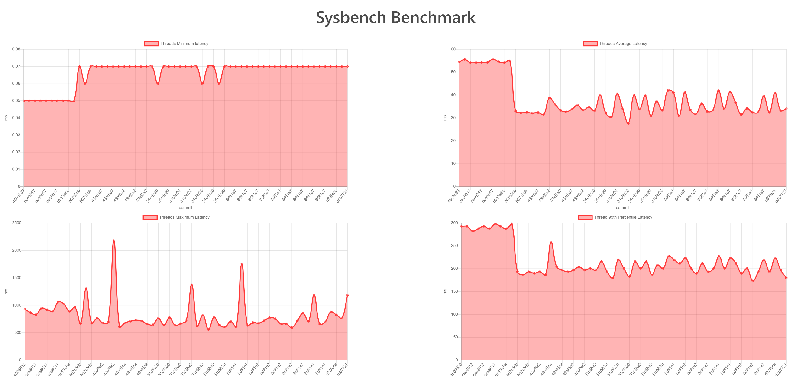

# Benchmark Demos

This set of demos shows how commonly used benchmarking tools can be run inside SGX enclaves with Occlum.

* [filebench](filebench/): A demo of [Filebench](https://github.com/filebench/filebench), a file system and storage benchmark tool.
* [fio](fio/): A demo of [Flexible I/O Tester](https://github.com/axboe/fio).
* [iperf2](iperf2/): A demo of [Iperf2](https://sourceforge.net/projects/iperf2/), a tool for measuring Internet bandwidth performance.
* [iperf3](iperf3/): A demo of [Iperf3](https://github.com/esnet/iperf), a tool for measuring Internet bandwidth performance.
* [sysbench](sysbench/): A demo of [Sysbench](https://github.com/akopytov/sysbench), a scriptable multi-threaded benchmark tool for Linux.

## Benchmarks Data

There is a enabled [benchmarks CI](https://github.com/occlum/ngo/blob/master/.github/workflows/benchmarks.yml) for continuous benchmarking. It utilizes the [github-action-benchmark](https://github.com/benchmark-action/github-action-benchmark) to provide a chart view for visualized historical benchmarks data on the GitHub pages.

The CI runs periodically. For example, **sysbench** has the historical benchmarks chart as below.

[**History Data**](https://occlum.io/ngo/dev/benchmarks/)