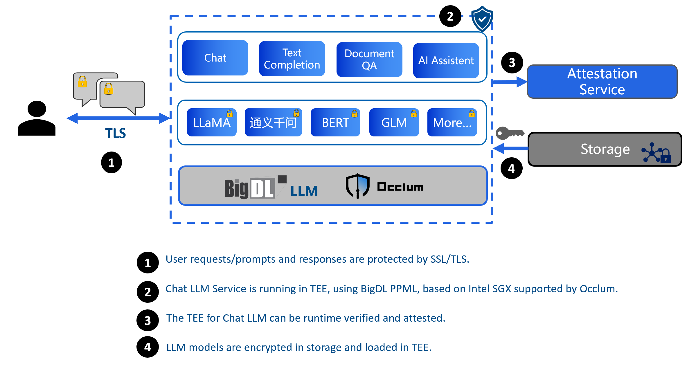

# LLM Inference in TEE

LLM ( Large Language Model) inference in TEE can protect the model, input prompt or output. The key challenges are:

1. the performance of LLM inference in TEE (CPU)
2. can LLM inference run in TEE?

With the significant LLM inference speed-up brought by [BigDL-LLM](https://github.com/intel-analytics/BigDL/tree/main/python/llm), and the Occlum LibOS, now high-performance and efficient LLM inference in TEE could be realized.

## Overview

Above is the overview chart and flow description.

For step 3, users could use the Occlum [init-ra AECS](https://occlum.readthedocs.io/en/latest/remote_attestation.html#init-ra-solution) solution which has no invasion to the application.

More details please refer to [LLM demo](https://github.com/occlum/occlum/tree/master/demos/bigdl-llm).
