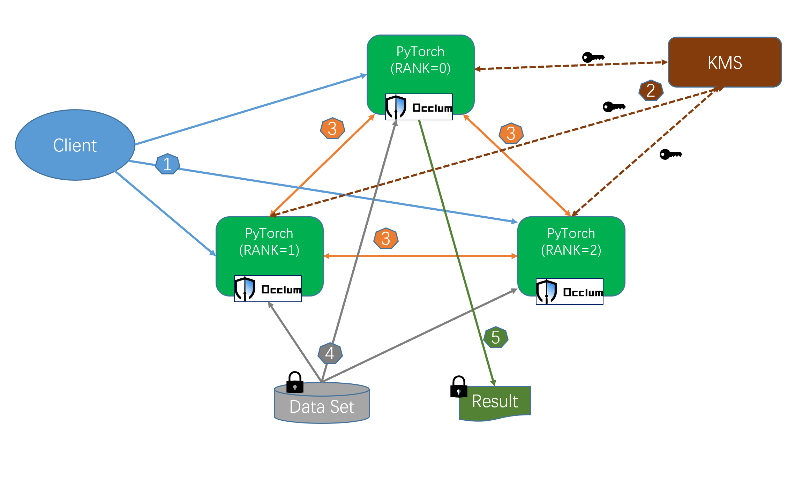

# Distributed PyTorch

[PyTorch](https://pytorch.org/) is well supported in Occlum. Unmodified distributed PyTorch training (such as fasion-MNIST dataset training) could be enabled running in TEE by simple steps. 

## Overview

Above is the flow chart which could be break down as below.

1. Client starts the PyTorch Occlum instances, such as one master and two worker nodes.
2. Every PyTorch Occlum instance starts, get required keys from one remote attestation based KMS. The keys could be for data decryption, result encryption or Pytorch nodes TLS certs.
3. PyTorch nodes set up rendezvous.
4. Loading dataset, training started.
5. Encrypt and save result if necessary.

For step 2, users could use the Occlum [init-ra AECS](https://occlum.readthedocs.io/en/latest/remote_attestation.html#init-ra-solution) solution which has no invasion to the PyTorch application.

More details please refer to [pytorch demo](https://github.com/occlum/occlum/tree/master/demos/pytorch/distributed).

Note, the demo has not involved KMS and data encryption or decryption. Users could add them accordingly.
