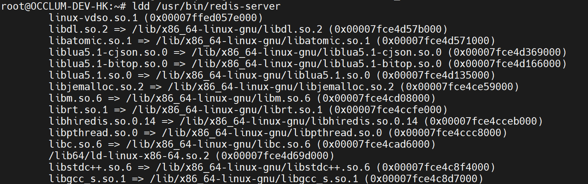

# Insight of Occlum Instance Generation

For every application to be running in Occlum (TEE env), all the running required files, libraries and binaries have to be put into Occlum file system. Here is the tree view of one Occlum instance.
```
./occlum_instance/
|-- Occlum.yaml
|-- build
|-- image       // Occlum root file system
|   |-- bin
|   |-- dev
|   |-- etc
|   |-- host
|   |-- lib
|   |-- lib64
|   |-- opt
|   |-- proc
|   |-- root
|   |-- sfs
|   |-- sys
|   `-- tmp
|-- initfs      // Occlum init file system
|   |-- bin
|   |-- dev
|   |-- etc
|   |-- lib
|   `-- proc
`-- run
```

## File System from Occlum Perspective

Let's clarify some definitions users usually get confused.
* **host file system**

Host means the environment where users run Occlum build. Usually it is the Occlum official docker image. In this environment, users build and prepare all files to be running in Occlum.

* **Occlum init file system**

Occlum has a unique **Occlum -> init ->application** boot flow, please check [boot_flow](https://occlum.readthedocs.io/en/latest/boot_flow.html) for detail. So the Occlum init file system is what the Occlum **init** process sees. In develop stage, it is in the path `occlum_instance/initfs`. Generally, a `occlum new` generates a default init file system, users don't need modify this part unless you know exactly what you are doing.

* **Occlum root file system**

It is the file system the real application sees. And it is also the place users need put all the running required files, libraries and binaries. In develop stage, it is in the path `occlum_instance/image`.

In summary, to generate Occlum instance, one important step is to copy application running required files from **host file system** to **Occlum root file system**.

Next, it is an example of using **copy_bom** to ease the Occlum root file system creation.

## Redis in Occlum

There is a redis demo in [github](https://github.com/occlum/occlum/tree/master/demos/redis) which is built from source. Actually, users could use the OS installed redis binary directly to generate a runnable Occlum Redis instance by following steps.

* Install the redis by **apt**.
```
apt install redis-server
```

* Create a **redis.yaml** to assist generate redis Occlum instance.
```redis.yaml
includes:
  - base.yaml
targets:
  - target: /bin
    copy:
      - files:
        - /usr/bin/redis-server
```

* Generate and build redis Occlum instance
```
occlum new redis_instance
cd redis_instance
copy_bom -f ../redis.yaml --root image --include-dir /opt/occlum/etc/template
occlum build
```

*  Run the redis server in Occlum
```
occlum run /bin/redis-server
```

The whole flow is like below.


Very easy and straightforward, right?

Next let's explore the magic of **copy_bom**.

## **copy_bom** Case Study

The `copy_bom` tool is designed to copy files described in a bom file to a given dest root directory. For details users could refer to [page](https://occlum.readthedocs.io/en/latest/tools/copy_bom.html).

The most important and useful function of copy_bom is the automatic dependencies finding and copy. For the redis case, there are so many dependent libraries the `redis-server` required for running.



All the dependent libraries above have to be copied to **occlum_instance**. But the **redis.yaml** showed above just has `redis-server`. How come it is running well in Occlum? 

That is because the `copy_bom` would detect binaries or libraries defined in the yaml file, find all the dependencies and copy them to the corresponding path in **occlum_instance/image**. For this case, all required libraries would be in place after `copy_bom` operation.


