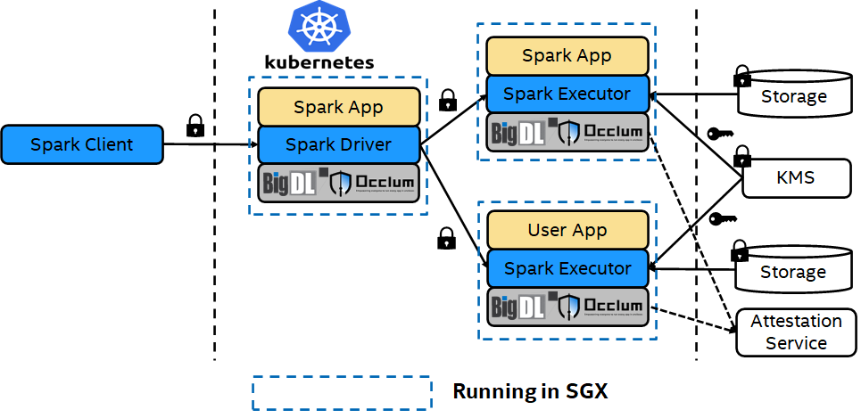

# Secure Spark Data Analytics using BigDL PPML and Occlum

Protecting privacy and confidentiality is critical for large-scale data analysis and machine learning. Occlum collaborates with BigDL [PPML](https://bigdl.readthedocs.io/en/latest/doc/PPML/Overview/intro.html), provides a Trusted Cluster Environment for secure Big Data & AI applications, even on untrusted cloud environment. The solution ensures end-to-end security enabled for the entire distributed Spark workflows.

## Overall Architecture

## PPML Occlum Spark on Azure

Please check the [link](https://bigdl.readthedocs.io/en/latest/doc/PPML/Overview/azure_ppml.html#) for all the details.

Also, there is a introduction document published in [Azure Confidential Computing Blog](https://techcommunity.microsoft.com/t5/azure-confidential-computing/bigdl-privacy-preserving-machine-learning-with-occlum-oss-on/ba-p/3658667), demonstrates the PPML Occlum solution using a sample analytics application built for the NYTaxi dataset.

## PPML Occlum Spark on Aliyun (Chinese version)

It is a detail how-to and technical insight about deploying the PPML Occlum Spark solution on Aliyun. Please check the [link](https://bigdl.readthedocs.io/en/latest/doc/PPML/Overview/ali_ecs_occlum_cn.html) for all the details.
