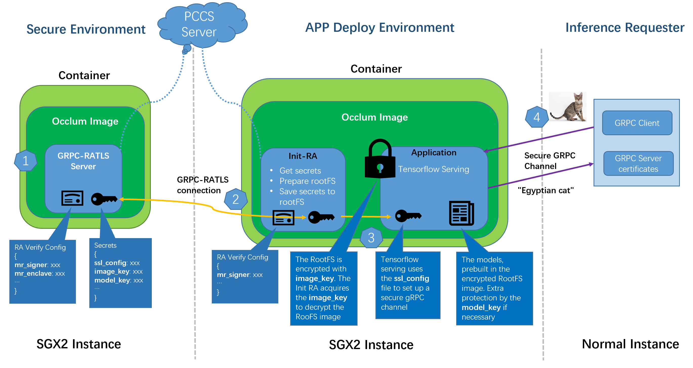

# Confidential Inference Service

This example introduces the development and deployment of a whole-flow confidential inference service case (`Tensorflow-serving`). By referring to this framework, application developers could get below benefits.

* Directly transfer the application to Occlum TEE application.
* No SGX remote attestation development required but still have whole-flow sensitive data protection.

## Highlights

* Whole-flow sensitive data protection by utilizing the Occlum [`GRPC RATLS`](../../tools/toolchains/grpc_ratls/) solution.

* Directly generate inference service (`Tensorflow-serving`) running in TEE from Docker image (`tensorflow/serving`) without modification.

* Way to build out the Docker container image in minimum size based on the Occlum package.

* Deploy Occlum Confidential Inference Service on Kubernetes please refer to [`kubernetes`](./kubernetes/).

## Overview



The GRPC-RATLS server holds some sensitive data thus it is usually deployed on secure environment. The application consuming the sensitive data could be deployed on general environment, such as Cloud service vendor provided SGX2 instance. There is no HW SGX requirement for the inference requester. For this example, all are running on one SGX2 instance.

### Flow

#### Step 1

GRPC-RATLS server starts and gets ready for any secret request through GRPC channel. In this example, it is `localhost:50051` in default.

In this example, two secrets need to be protected.

* **`ssl_config`**
It is a tensorflow-serving required SSL config file to set up a secure gRPC channel. It is generated by combining `server.key` and `server.crt`. The `server.key` is a private key and `server.crt` is a self-signed certificate, both are generated by `openssl`. Details please refer to script [`generate_ssl_config.ssh`](./generate_ssl_config.sh).

* **`image_key`**
It is used to encrypt/decrypt the Occlum application RootFS image which is Tensorflow-serving in this example. It is generated by command `occlum gen-image-key image_key`. The image encryption could be done by `occlum build --image-key image-key`. With this encryption, anything saved in the RootFS has a good protection.

#### Step 2

Application starts. First it starts the `init` process. This customized [`init`](../tools/init_grpc_ratls/) requests `ssl_config` and `image_key` from GRPC-RATLS server through a secure GRPC RATLS connection. Then it uses the `image_key` to decrypt the RootFS where the real application is located, mount the RootFS, save the `ssl_config` to RootFS `/etc/tf_ssl.cfg`.

Detail description of the above two steps Init-RA operation could refer to [`Init-RA`](../demos/remote_attestation/init_ra_flow/).

#### Step 3

The real application `tensorflow_model_server` starts with `tf_ssl.cfg` and prefetched model, serves an inference service through secure GRPC channel which is `localhost:9000` in this example.

Extra model_key could be added to protect the models if necessary. (not included in this demo)

#### Step 4

Now users could send inference request with server certificates (`server.crt`).

## Get the demo docker images

There are prebuilt docker images could be used for the examples, either in the following docker way or [`kubernates`](./kubernetes/) way. Users could pull them directly and try the example.
```
docker pull occlum/init_ra_server:0.29.6-ubuntu20.04
docker pull occlum/tf_demo:0.29.6-ubuntu20.04
docker pull occlum/tf_demo_client:0.29.6-ubuntu20.04
```

If users want to build or customize the images, please check below part.

## How-to build

Our target is to deploy the demo in separated container images, so docker build is necessary steps. Thanks to the `docker run in docker` method, this example build could be done in Occlum development container image.

First, please make sure `docker` is installed successfully in your host. Then start the Occlum container (use version `latest-ubuntu20.04` for example) as below.
```
$ sudo docker run --rm -itd --network host \
        -v $(which docker):/usr/bin/docker -v /var/run/docker.sock:/var/run/docker.sock \
        occlum/occlum:latest-ubuntu20.04
```

All the following are running in the above container.

### Build all the content

This step prepares all the content and builds the Occlum images.

```
# ./build_content.sh
```

Below are the two Occlum images.

* **occlum_server**

It works as the role of GRPC-RATLS server.
The primary content are from toolchain [`ra_tls`](../tools/toolchains/grpc_ratls).

* **occlum_tf**

It works as the role of Init-RA and tensorflow-serving.

For the tensorflow-serving, there is no need rebuild from source, just use the one from docker image `tensorflow/serving`. This example combines the docker image export and Occlum `copy_bom` tool to generate a workable tensorflow-serving Occlum image. Details please refer to the script [`build_content.sh`](./build_content.sh).

### Build runtime container images

Once all content ready, runtime container images build are good to go.
This step builds two container images, `init_ra_server` and `tf_demo`.
```
# ./build_container_images.sh <registry> <tag>
```

`<registry>` means the docker registry prefix for the generated container images.
For example, using `demo` here will generate container images:
```
demo/init_ra_server
demo/tf_demo
```

To minimize the size of the container images, only necessary SGX libraries and runtime Occlum RPM got installed, plus the packaged Occlum image. The build script and Dockerfile are in directory [`container`](./container/).

## How-to run

### Start the tensorflow serving

Once the container images are ready, demo could be started in the host.

Script [`run_container.sh`](./run_container.sh) is provided to run the container images one by one.
```
$ ./run_container.sh -h
Run container images init_ra_server and tf_demo on background.
usage: run_container.sh [OPTION]...
    -s <GRPC Server Domain> default localhost.
    -p <GRPC Server port> default 50051.
    -u <PCCS URL> default https://localhost:8081/sgx/certification/v3/.
    -r <registry prefix> the registry for this demo container images.
    -g <image tag> the container images tag, default it is "latest".
    -h <usage> usage help
```

For example, using PCCS service from aliyun.
```
$ sudo ./run_container.sh -s  localhost -p 50051 -u https://sgx-dcap-server.cn-shanghai.aliyuncs.com/sgx/certification/v3/ -r demo -g <tag>
```

If everything goes well, the tensorflow serving service would be available by GRPC secure channel `localhost:9000`.

### Try the inference request

There is an example python based [`inference client`](./client/inception_client.py) which sends a picture to tensorflow serving service to do inference with previously generated server certificate.

Install the dependent python packages.
```
# pip3 install -r client/requirements.txt
```

Start the inference request.
```
# cd client
# python3 resnet_client_grpc.py --server=localhost:9000 --crt ../ssl_configure/server.crt --image cat.jpg
```

If everything goes well, you will get the most likely predication class (int value, mapping could be found on https://storage.googleapis.com/download.tensorflow.org/data/ImageNetLabels.txt) and its probability.

Or you can use the demo client container image to do the inference test.
```
$ docker run --rm --network host <registry>/tf_demo_client:<tag> python3 resnet_client_grpc.py --server=localhost:9000 --crt server.crt --image cat.jpg
```
