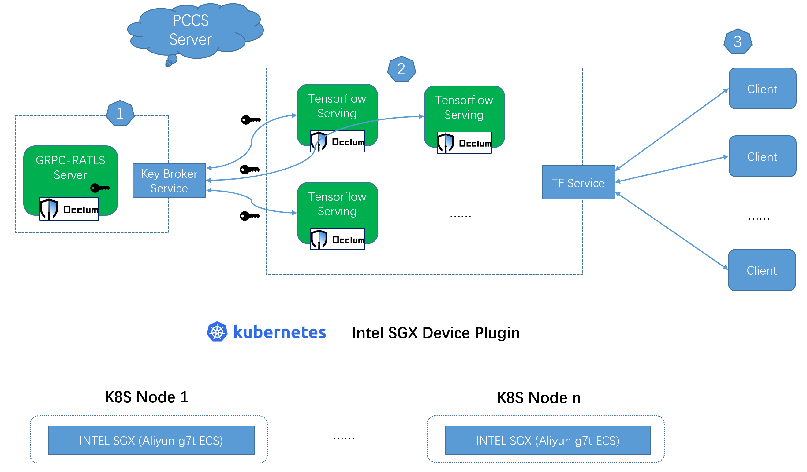

# Deploy Occlum Confidential Inference Service on Kubernetes

Besides the traditional Docker deployment way, [`Kubernetes`](https://kubernetes.io/docs/concepts/overview/) is the most popular platform for managing containerized workloads and services. This example introduces a solution to deploy scalable Occlum Confidential Inference Service on a single Kubernetes cluster.

## Overview



The technical background of the GRPC RATLS based remote attestation and the detail secrets protection please refer to [`README.md`](../README.md). For the kubernetes components, brief introduction as below.

### Key broker service

The GRPC-RATLS Server pod works as a key broker service, dispatching secrets per request through the GRPC-RATLS connection from the tensorflow serving pods.

### TF Service

Multiple tensorflow serving pods export as TF service by NodePort type in this case.
The number of tensorflow serving pods could be scaled according to the actual EPC resource.

### Client

Clients can send inference request with server certificates (`server.crt`) to the TF service.

## Environment set up

### Prerequisites

* Aliyun confidential enhancement ECS nodes (g7t) with 32GB EPC

* Ubuntu 20.04 LTS2 with SGX supported kernel

The kernel could be installed by below command.
```
$ sudo apt install --install-recommends linux-generic-hwe-20.04
```

* One single kubernetes cluster with at least one worker node

In this case, one master node, one worker node, both running on Aliyun g7t ECS with 32GB EPC.

* Intel SGX device plugin installed

Please refer to [`INTEL SGX Plugin Installation`](https://github.com/intel/intel-device-plugins-for-kubernetes/blob/main/cmd/sgx_plugin/README.md#installation) for detail.

## How to build

There is one script [`./build.sh`](build.sh) provided for container images build.
```
Build Occlum TF examples container images for k8s deployment.
usage: build.sh [OPTION]...
    -r <container image registry> the container image registry
    -g <tag> container image tag
```

For example, below command generates three container images.
```
# ./build.sh -r demo -g 0.29.6
```

* **`demo/init_ra_server:0.29.6`** acts as key broker pod.
* **`demo/tf_demo:0.29.6`** acts as tensorflow serving pod.
* **`demo/tf_demo_client:0.29.6`** acts as client.

## How to test

### Modify the template yaml files

* Modify the container image names and tag according to your build command.
* Modify the port according to your build command.
* Modify the `PCCS_URL` environment value according to your env.

* Update the resource limits if necessary.
```
        resources:
          limits:
            sgx.intel.com/epc: "8000Mi"
            cpu: "1000m"
```
In this case, for inference, "8000MB" SGX EPC memory size is used because Occlum `user_space_size` is set to "7000MB" in building stage. cpu limits "1000m" here is to limit the CPU usage for each Occlum inference pod with the purpose to show the performance gain by scalability in `benchmark`.

* Args `"taskset -c 0-3"` is necessary till Occlum v1.0 release. The purpose is to limit the CPU cores used in tensorflow serving which makes the SGX thread number used won't exceed the `max_num_of_threads` defined in building stage.


### Start the key broker service

```
$ kubectl apply -f occlum_init_ra_server.yaml
```

Wait a while, you can see below log for the pod if successful.
```
Server listening on 0.0.0.0:5000
```

### Start the tensorflow serving pods

```
$ kubectl apply -f occlum_tf_demo.yaml
```

Wait a while, you can see below log for the pod if successful.
```
Running gRPC ModelServer at 0.0.0.0:9001 ...
```

In default, only one replica for the tensorflow serving pod.

### Try the inference request

```
$ docker run --rm --network host demo/tf_demo_client:0.29.6 python3 resnet_client_grpc.py --server=localhost:31001 --crt server.crt --image cat.jpg
```

If successful, it prints the classification results.

### Benchmark

Below command can do benchmark test for the tensorflow serving service running in Occlum.

```
$ docker run --rm --network host demo/tf_demo_client:0.29.6 python3 benchmark.py --server localhost:31001 --crt server.crt --cnum 4 --loop 10 --image cat.jpg
```

Try scale up the tensorflow serving pods number, better `tps` can be achieved.
For example, scale up to 3.
```
$ kubectl scale deploy tf-demo-deployment --replicas 3
```

## Alternatives

### Running environment

Cloud Service Providers (CSPs), such as Azure and Aliyun, provide confidential computing infrastructure (SGX TEE). This example assumes to run on Aliyun, self created kubernetes cluster. But theoretically it can run on any SGX VM/baremetal based kubernetes cluster.

### Attestation

This example uses GRPC-RATLS based remote attestation solution. With minor changes, it can accommodate to other attestation solutions listed below. The key point is to do the remote attestation in Occlum init process, leaving the application unmodified as far as possible.

#### [Microsoft Azure Attestation](https://docs.microsoft.com/en-us/azure/attestation/overview)

Put the RA operation in Occlum init process just like the demo [`maa_init`](../../demos/remote_attestation/azure_attestation/maa_init/). And Users can use Azure Key Vault to act as key broker service.

#### [KubeTEE AECS](https://github.com/SOFAEnclave/enclave-configuration-service)

AECS server acts as a key broker service,  and put the AECS client in Occlum init process in the tensorflow serving pod.
